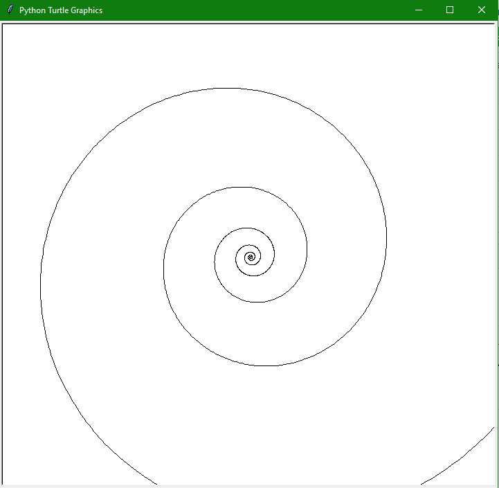

# Turtle-library-exercises
Solutions "Python Playground Geeky Projects for the Curioys Programmer" Mahesh Venkitachalam, Python documentation, Stack Overflow.
In this exercises I used Turtle library to draw circle, ellipse, spiral and logarithmic spiral. Book showed me, how restart drawing
or save as an image. I used parametric equation.

